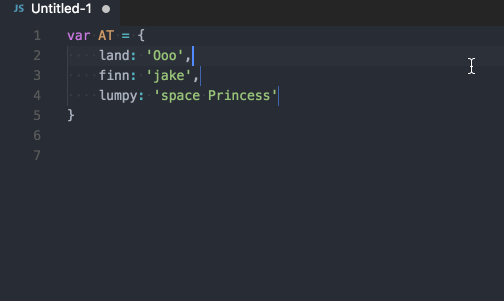

# hungry-backspace

Get tired of hitting backspace multiple times just to remove a line thats only whitespace? Hungry-backspace will remove those pesky whitespaces in one keypress and put your cursor on the line above.

No extra keybindings or commands to learn, just backspace.

### Without hungry-backspace

### With hungry-backspace

### Multi-cursor
